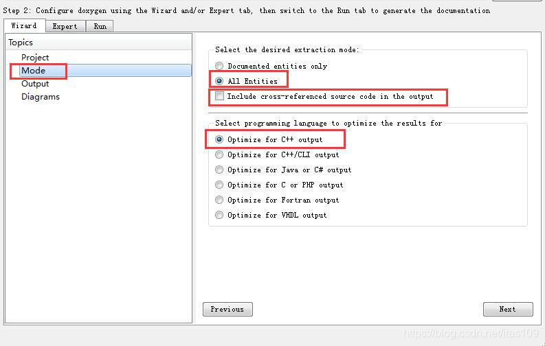
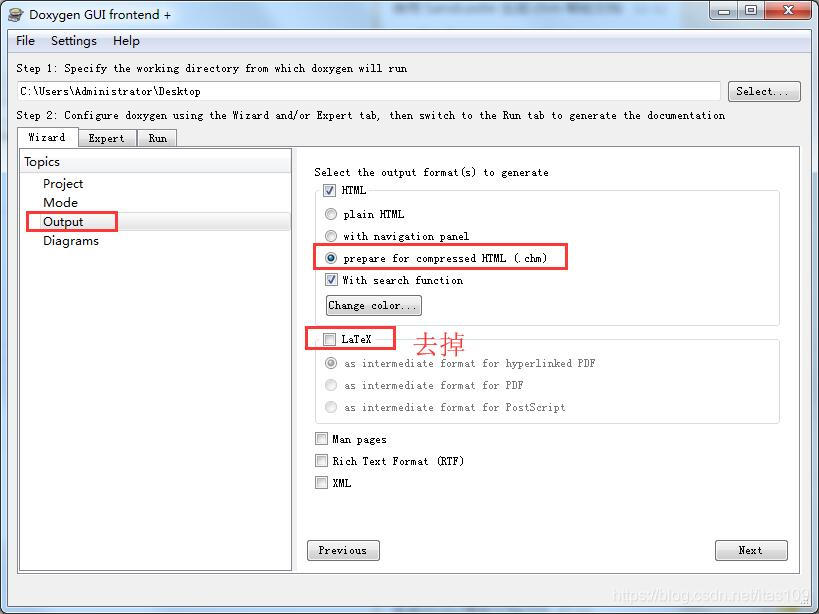
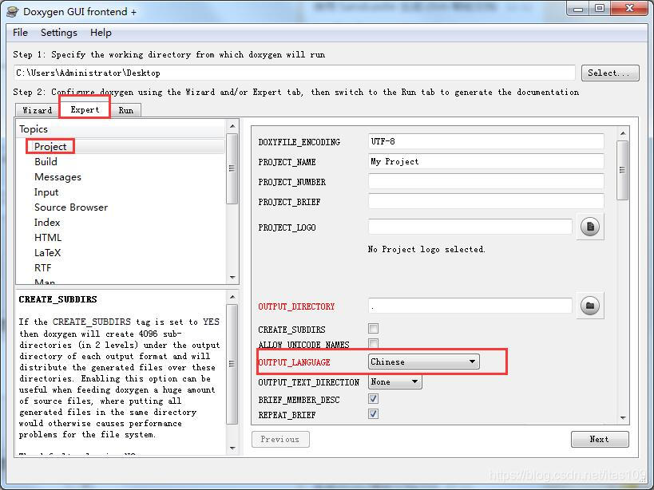
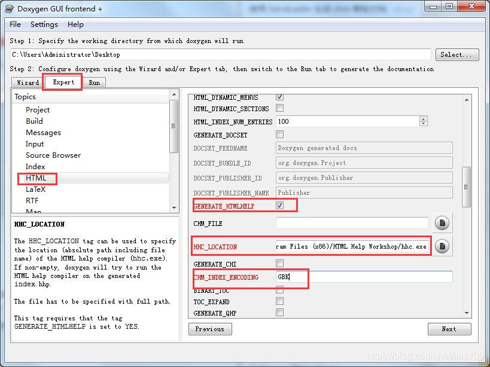
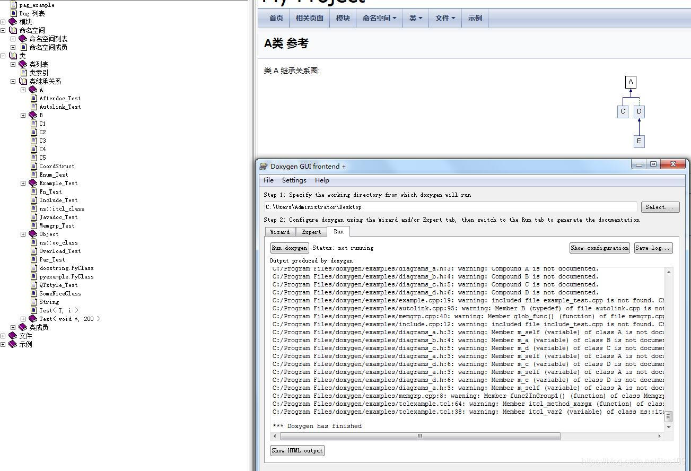

3.Doxygen和Microsoft HTML Help安装
略

4.配置Doxygen Gui导出CHM
4.1 基本信息设置
4.1.1 Project 信息设置
Project name(项目名称)：在首页显示
Source code directory(源码目录)：源代码目录
Scan recursively(递归扫描)：对目录下的所有子目录及文件扫描
Destination directory(输出目录)：生成的帮助文档的路径

4.2 Mode设置
选择优化C++输出即可

mode 下面的"Include cross-refrrenced source code in output"这个选项, 输出可以看到源文件
mode 下面的"All Entities"这个选项，表示输出所有的实体。如果没有选择项enum等都不会输出

4.3 output输出设置
这里设置"prepare for compressed HTML(.chm)"

4.2 高级设置
4.2.1 Project高级设置
OUTPUT_LANGUAGE设置为中文Chinese

4.2.2 Html高级设置
这里主要是CHM和中文设置

GENERATE\_HTMLHELP：HHC\_LOCATION前置选项
HHC_LOCATION：chm 编译器位置，这里为 HTML Help Workshop 的安装目录的 hhc.exe ，默认为C:/Program Files (x86)/HTML Help Workshop/hhc.exe
CHM\_INDEX\_ENCODING：chm索引文件编码，这里为“GBK”

4.3 生成CHM文档
设置好了后，点击“Run”→“Run doxygen”生成最终的.chm文档
